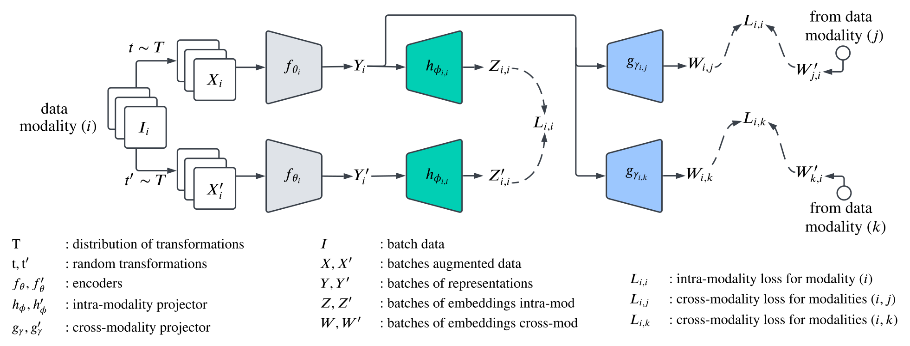

# MMod-VICeg
MMod-VICReg: Multi-Modal Variance-Invariance-Covariance Regularization for Self-Supervised Learning.

  

## 📌&nbsp;&nbsp;Introduction
This repository provides VICReg implementation for Multi-Modal Self-Supervised Learning, as described in the paper [VICReg: Variance-Invariance-Covariance Regularization For Self-Supervised Learning](https://arxiv.org/pdf/2105.04906.pdf). 

